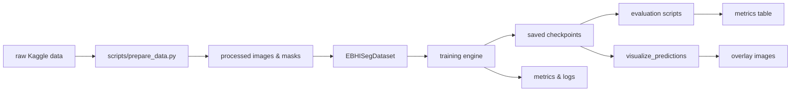

### Colorectal Cancer Biopsy Segmentation with U‑Net (PyTorch)

This project implements a PyTorch‑based deep learning pipeline for colorectal cancer biopsy segmentation using the **Colorectal Cancer WSI / EBHI‑Seg** dataset. The dataset contains H&E‑stained biopsy images with corresponding pixel‑level annotations for six tumor differentiation stages:

- **normal**
- **polyp**
- **low‑grade intraepithelial neoplasia**
- **high‑grade intraepithelial neoplasia**
- **serrated adenoma**
- **adenocarcinoma**

We train a U‑Net‑style convolutional neural network to perform **multi‑class semantic segmentation**, predicting a label for each pixel in the input image. This allows the model to highlight where different lesion types appear in the tissue, mimicking a pathologist’s visual assessment.

---

### Project structure

- `config/default.yaml` – paths, data settings, model hyperparameters, and training/scheduler config.
- `data/`
  - `raw/colorectal-cancer-wsi/` – Kaggle dataset as downloaded.
  - `processed/images/` – resized RGB PNG patches.
  - `processed/masks/` – aligned label masks (integer class IDs).
  - `splits/{train,val,test}.txt` – image IDs for each split.
- `src/`
  - `datasets/`
    - `ebhi_seg_dataset.py` – `EBHISegDataset` for images + masks.
    - `transforms.py` – Albumentations augmentation and normalization pipelines.
  - `models/`
    - `unet.py` – U‑Net encoder–decoder with skip connections.
    - `losses.py` – cross‑entropy, Dice, and combined losses.
  - `training/`
    - `engine.py` – generic `train_one_epoch` / `validate` loops.
    - `train_segmentation.py` – CLI training script.
    - `scheduler.py` – simple LR scheduler factory.
  - `evaluation/`
    - `metrics.py` – Dice, IoU, pixel accuracy, confusion matrix.
    - `evaluate_segmentation.py` – run evaluation on the test split.
    - `visualize_predictions.py` – save prediction vs. ground‑truth overlays.
  - `utils/`
    - `paths.py` – project‑root and path helpers, config loading.
    - `seed.py` – global seeding for reproducibility.
    - `logging_utils.py` – CSV logging and metric formatting.
- `scripts/`
  - `download_kaggle.sh` – Kaggle CLI download helper.
  - `prepare_data.py` – converts raw Kaggle layout → `data/processed/` and creates splits.
  - `train_unet.sh` – convenience wrapper around the training script.
- `notebooks/`
  - `01_eda_visualization.ipynb` – EDA and qualitative data inspection.
  - `02_sanity_check_unet.ipynb` – tiny overfit sanity check.

---

### Setup

1. **Create environment and install dependencies**

   ```bash
   cd colorectal-wsi-segmentation
   python -m venv .venv
   source .venv/bin/activate  # on Windows: .venv\\Scripts\\activate
   pip install --upgrade pip
   pip install -r requirements.txt
   ```

2. **Configure Kaggle API**

   - Create a Kaggle account and API token (`kaggle.json`).
   - Place `kaggle.json` under `~/.kaggle/` and ensure it has `0600` permissions.
   - Test:

     ```bash
     kaggle datasets list -s colorectal
     ```

3. **Download and prepare data**

   ```bash
   # Download raw dataset
   bash scripts/download_kaggle.sh

   # Prepare processed images, masks, and splits
   python scripts/prepare_data.py --config config/default.yaml
   ```

   This will create:

   - `data/processed/images/*.png`
   - `data/processed/masks/*.png`
   - `data/splits/{train,val,test}.txt`

---

### Training

On a CPU‑only machine, use modest settings (default \(256 \times 256\) inputs, small batch size):

```bash
bash scripts/train_unet.sh
# or
python -m src.training.train_segmentation --config config/default.yaml --epochs 20 --batch-size 4
```

The script will:

- **Instantiate a U‑Net** with configurable `base_channels`.
- **Train with combined cross‑entropy + Dice loss**.
- **Log per‑epoch metrics** to `outputs/logs/training_log.csv`.
- **Save the best checkpoint** to `checkpoints/best_model.pt` (based on validation mean Dice).

---

### Evaluation

After training:

```bash
python -m src.evaluation.evaluate_segmentation \
  --config config/default.yaml \
  --checkpoint checkpoints/best_model.pt
```

This computes:

- **Per‑class IoU and Dice**
- **Mean IoU (mIoU)**
- **Mean Dice**
- **Overall pixel accuracy**

---

### Visualization

To qualitatively inspect predictions:

```bash
python -m src.evaluation.visualize_predictions \
  --config config/default.yaml \
  --checkpoint checkpoints/best_model.pt \
  --split val \
  --num-samples 12
```

This produces:

- `outputs/visualizations/<id>_image.png`
- `outputs/visualizations/<id>_gt.png` (ground‑truth overlay)
- `outputs/visualizations/<id>_pred.png` (model prediction overlay)

---

### Methodology (summary)

- **Data**: H&E biopsy images with pixel‑wise labels for six colorectal lesion categories.
- **Model**: U‑Net encoder–decoder CNN with skip connections and configurable width, suitable for CPU‑scale experiments.
- **Training**: Supervised learning with Adam optimizer, mini‑batches, data augmentation (flips, rotations, color jitter), and optional learning‑rate scheduling.
- **Losses**: Multi‑class cross‑entropy plus per‑class soft Dice loss.
- **Metrics**: Per‑class Dice, mean IoU, and pixel accuracy on a held‑out test split.
- **Outputs**: Trained model weights, CSV logs, metric summaries, and visual overlays of predictions vs. ground truth.

---

### High‑level workflow




